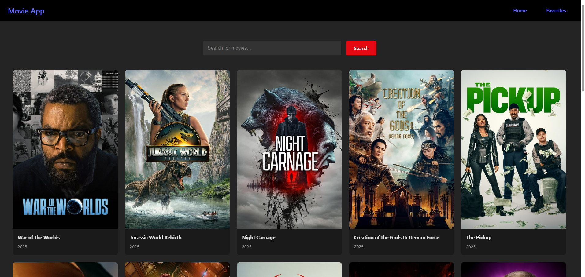

# React Movie App

A modern, fully responsive web application built with React that lets users search, explore, and discover movies using a dynamic and user-friendly interface. The app fetches data from a public movie API and provides users with movie details, ratings, and more.

## Features

- 🔍 **Search Movies:** Find movies by title.
- 📄 **Detailed Info:** View movie details, ratings, genres, and release dates.
- 📱 **Responsive Design:** Works seamlessly across devices.
- ⭐ **Add to Favorites:** Save movies you love (if implemented).
- 🎬 **Trending & Popular:** Explore trending and popular movies.
- 🖼️ **Screenshots:**  
   

## Getting Started

### Installation

1. **Clone the repository:**
   ```bash
   git clone https://github.com/pratikrane412/React-Movie-App.git
   cd React-Movie-App
   ```

2. **Install dependencies:**
   ```bash
   npm install
   ```

3. **Start the app:**
   ```bash
   npm start
   ```
   The app will run locally at `http://localhost:3000`.

### Configuration

- If your app uses an API key (such as TMDb), create a `.env` file in the root and add your key:
  ```
  REACT_APP_API_KEY=your_api_key_here
  ```

## Technologies Used

- [React](https://react.dev/)
- [Axios](https://axios-http.com/) (or fetch API)
- [React Router](https://reactrouter.com/) (if routing is implemented)
- [Styled Components / CSS Modules / SCSS] (choose the one used)
- [TMDb API](https://www.themoviedb.org/documentation/api) or other public movie API


## Contact

Created by [pratikrane412](https://github.com/pratikrane412)  
Feel free to contact for any questions or collaboration opportunities.
